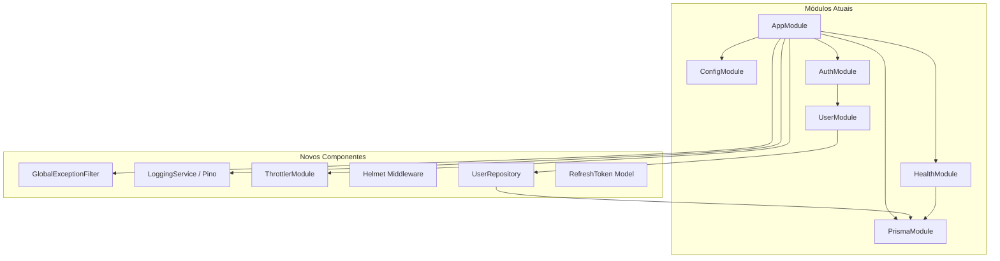
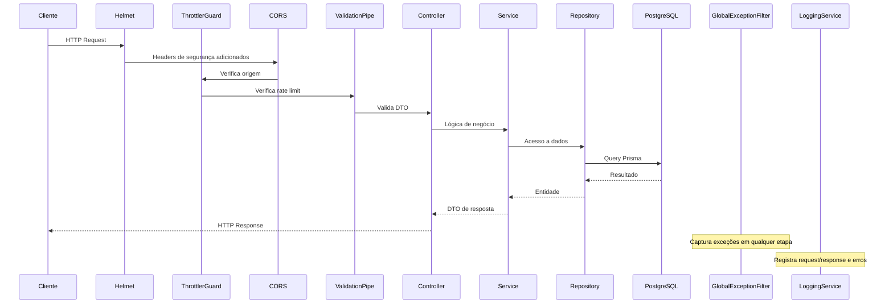

# Design — Melhorias Técnicas da Manager API

## Visão Geral

Este documento descreve o design técnico para as 24 melhorias identificadas na Manager API. As mudanças abrangem segurança, arquitetura, qualidade de código, performance, design patterns, produção e experiência do desenvolvedor. O objetivo é elevar a aplicação de um estado funcional básico para um nível production-ready, mantendo compatibilidade com o stack existente (NestJS 11, Prisma 7, PostgreSQL, class-validator).

### Decisões de Design Principais

1. **Bibliotecas escolhidas**: `@nestjs/throttler` para rate limiting, `helmet` para headers HTTP, `pino`/`nestjs-pino` para logging estruturado, `fast-check` para property-based testing
2. **Repository Pattern**: Interface `IUserRepository` com implementação Prisma, permitindo injeção de dependência e testabilidade
3. **Refresh Token**: Armazenado como hash bcrypt no banco, com modelo Prisma dedicado
4. **Global Exception Filter**: Filtro centralizado registrado via `APP_FILTER` no AppModule
5. **Versionamento**: URI prefix (`/v1/`) via `VersioningType.URI` do NestJS

---

## Arquitetura

### Diagrama de Módulos (Atual vs. Proposto)



### Fluxo de Requisição (Proposto)



---

## Componentes e Interfaces

### 1. Segurança — CORS (Req 1)

**Arquivo**: `src/main.ts`

Configurar CORS com origens lidas de `CORS_ORIGINS` (variável de ambiente, lista separada por vírgula).

```typescript
// src/main.ts
const corsOrigins = configService.getOrThrow<string>('corsOrigins');
app.enableCors({
  origin: corsOrigins.split(',').map(o => o.trim()),
  methods: ['GET', 'POST', 'PUT', 'PATCH', 'DELETE'],
  credentials: true,
});
```

**Config**: Adicionar `corsOrigins` em `load.config.ts` e validação em `load.validation.ts`.

### 2. Segurança — Helmet (Req 2)

**Arquivo**: `src/main.ts`

```typescript
import helmet from 'helmet';
app.use(helmet());
```

**Dependência**: `yarn add helmet` + `yarn add -D @types/helmet`

### 3. Segurança — Rate Limiting (Req 3)

**Módulo**: `@nestjs/throttler`

```typescript
// src/app.module.ts
ThrottlerModule.forRoot({
  throttlers: [
    { name: 'default', ttl: 60000, limit: 60 },
    { name: 'auth', ttl: 60000, limit: 10 },
  ],
}),
```

Aplicar `@Throttle({ auth: { ttl: 60000, limit: 5 } })` nas rotas `sign-in` e `sign-up`. Registrar `ThrottlerGuard` como guard global via `APP_GUARD`.

**Mensagem 429**: Customizar via exception filter para retornar mensagem em pt-BR: `"Limite de requisições excedido. Tente novamente em alguns minutos."`.

### 4. Segurança — Validação de Senha (Req 4)

**Arquivo**: `src/modules/user/dto/create-user.dto.ts`

```typescript
@Matches(/^(?=.*[a-z])(?=.*[A-Z])(?=.*\d).{8,}$/, {
  message: 'A senha deve ter no mínimo 8 caracteres, incluindo uma letra maiúscula, uma minúscula e um número.',
})
password!: string;
```

Substituir `@MinLength(6)` pelo `@Matches` com regex de complexidade.

### 5. Segurança — Strict TypeScript (Req 5)

**Arquivos**: `tsconfig.json`, `eslint.config.mjs`

```jsonc
// tsconfig.json
{
  "compilerOptions": {
    "noImplicitAny": true,
    "strictBindCallApply": true
  }
}
```

```javascript
// eslint.config.mjs
'@typescript-eslint/no-explicit-any': 'error',
```

### 6. Arquitetura — Global Exception Filter (Req 6)

**Arquivo**: `src/common/filters/global-exception.filter.ts`

```typescript
@Catch()
export class GlobalExceptionFilter implements ExceptionFilter {
  catch(exception: unknown, host: ArgumentsHost) {
    const ctx = host.switchToHttp();
    const response = ctx.getResponse<Response>();

    if (exception instanceof HttpException) {
      const status = exception.getStatus();
      const exceptionResponse = exception.getResponse();
      response.status(status).json({
        statusCode: status,
        message: typeof exceptionResponse === 'string'
          ? exceptionResponse
          : (exceptionResponse as any).message,
        error: exception.name,
        timestamp: new Date().toISOString(),
      });
    } else {
      // Log stack trace
      response.status(500).json({
        statusCode: 500,
        message: 'Erro interno do servidor.',
        error: 'InternalServerError',
        timestamp: new Date().toISOString(),
      });
    }
  }
}
```

Registrar via `APP_FILTER` no `AppModule`:

```typescript
{ provide: APP_FILTER, useClass: GlobalExceptionFilter }
```

### 7. Arquitetura — Logging Estruturado (Req 7)

**Dependência**: `nestjs-pino` + `pino-pretty` (dev)

```typescript
// src/app.module.ts
LoggerModule.forRoot({
  pinoHttp: {
    transport: process.env.NODE_ENV !== 'production'
      ? { target: 'pino-pretty' }
      : undefined,
  },
}),
```

Substituir `console.log` no `main.ts` por `app.get(Logger).log(...)`. O middleware do `nestjs-pino` automaticamente registra método, URL, status code e tempo de resposta para cada requisição HTTP.

### 8. Arquitetura — Graceful Shutdown do Prisma (Req 8)

**Arquivo**: `src/modules/prisma/prisma.service.ts`

```typescript
@Injectable()
export class PrismaService extends PrismaClient implements OnModuleInit, OnModuleDestroy {
  // ... constructor e onModuleInit existentes

  async onModuleDestroy() {
    await this.$disconnect();
  }
}
```

**Arquivo**: `src/main.ts` — adicionar `app.enableShutdownHooks()`.

### 9. Arquitetura — Health Check com DB (Req 9)

**Arquivo**: `src/modules/health/health.controller.ts`

Criar um `PrismaHealthIndicator` que execute `prisma.$queryRaw(SELECT 1)` e meça o tempo de resposta.

```typescript
@Get()
@HealthCheck()
check() {
  return this.health.check([
    () => this.prismaHealth.isHealthy('database'),
  ]);
}
```

### 10. Qualidade — Remoção de Dependências (Req 10)

Remover do `package.json`:
- `@nestjs/typeorm`, `typeorm`, `sqlite3`
- `@prisma/adapter-better-sqlite3`, `@types/better-sqlite3`
- `serverless-http`

### 11. Qualidade — Soft Delete Consistente (Req 11)

**Arquivo**: `src/modules/user/user.service.ts` (e futuro `user.repository.ts`)

Adicionar `deleteAt: null` em todas as cláusulas `where` de leitura:

```typescript
async readOneByEmail(email: string) {
  const user = await this.prisma.user.findFirst({
    where: { email, deleteAt: null },
  });
  if (!user) throw new UserNotFoundException();
  return user;
}
```

Adicionar método `softDelete`:

```typescript
async softDelete(id: string) {
  await this.readOneById(id); // verifica existência
  return this.prisma.user.update({
    where: { id },
    data: { deleteAt: new Date() },
  });
}
```

### 12-13. Qualidade — Testes Unitários e E2E (Reqs 12-13)

- Testes unitários em `src/modules/auth/auth.service.spec.ts` e `src/modules/user/user.service.spec.ts`
- Testes e2e em `test/auth.e2e-spec.ts` com banco de teste isolado
- Property-based tests com `fast-check` para validações e lógica de negócio

### 14. Escalabilidade — Paginação (Req 14)

**Novos arquivos**:
- `src/common/dto/pagination-query.dto.ts` — DTO com `page` (min: 1) e `limit` (min: 1, max: 100)
- `src/common/dto/paginated-response.dto.ts` — Wrapper com `data`, `total`, `page`, `totalPages`

```typescript
// UserService
async findAll(query: PaginationQueryDto) {
  const { page, limit } = query;
  const skip = (page - 1) * limit;
  const [data, total] = await Promise.all([
    this.userRepository.findMany({ skip, take: limit }),
    this.userRepository.count(),
  ]);
  return { data, total, page, totalPages: Math.ceil(total / limit) };
}
```

### 15. Performance — Índices de Banco (Req 15)

**Arquivo**: `prisma/schema.prisma`

```prisma
model User {
  // ... campos existentes

  @@index([email, deleteAt])
  @@index([createAt])
}
```

### 16. Performance — Cache de ConfigModule (Req 16)

**Arquivo**: `src/app.module.ts`

```typescript
ConfigModule.forRoot({
  load: [loadConfig],
  validate: loadValidation,
  isGlobal: true,
  cache: true, // <-- adicionar
}),
```

### 17. Design Patterns — Repository Pattern (Req 17)

**Novos arquivos**:
- `src/modules/user/interfaces/user-repository.interface.ts`
- `src/modules/user/user.repository.ts`

```typescript
// Interface
export interface IUserRepository {
  create(data: Prisma.UserCreateInput): Promise<UserModel>;
  findByEmail(email: string): Promise<UserModel | null>;
  findById(id: string): Promise<UserModel | null>;
  softDelete(id: string): Promise<UserModel>;
  findMany(params: { skip: number; take: number }): Promise<UserModel[]>;
  count(where?: Prisma.UserWhereInput): Promise<number>;
}

// Implementação
@Injectable()
export class UserRepository implements IUserRepository {
  constructor(private readonly prisma: PrismaService) {}

  async findByEmail(email: string) {
    return this.prisma.user.findFirst({ where: { email, deleteAt: null } });
  }
  // ... demais métodos
}
```

**Injeção**: Usar token `USER_REPOSITORY` com `useClass: UserRepository` no `UserModule`.

### 18. Design Patterns — Refresh Token (Req 18)

**Modelo Prisma**:

```prisma
model RefreshToken {
  id        String   @id @default(uuid())
  tokenHash String
  userId    String
  user      User     @relation(fields: [userId], references: [id])
  expiresAt DateTime
  createAt  DateTime @default(now())

  @@index([userId])
  @@index([tokenHash])
}
```

**Fluxo**:
1. Login/Registro → gera access token (curta duração, ex: 15min) + refresh token (longa duração, ex: 7 dias)
2. Refresh token é hasheado com bcrypt e salvo no banco
3. Endpoint `POST /auth/refresh` recebe o refresh token, valida hash, emite novo access token
4. Refresh tokens expirados/inválidos → HTTP 401

**Novos arquivos**:
- `src/modules/auth/dto/refresh-token.dto.ts`
- `src/modules/auth/dto/auth-response.dto.ts` — atualizar para incluir `refreshToken`

### 19. Produção — Versionamento de API (Req 19)

**Arquivo**: `src/main.ts`

```typescript
app.enableVersioning({
  type: VersioningType.URI,
  defaultVersion: '1',
});
```

Controllers existentes recebem `@Controller({ version: '1', path: '...' })`.

### 20. Produção — Variáveis Seguras (Req 20)

**Arquivo**: `src/config/load.config.ts`

Remover todos os fallbacks (`??`) para variáveis sensíveis:

```typescript
export const loadConfig = () => ({
  port: Number(process.env.PORT),
  databaseUrl: process.env.DATABASE_URL,
  salt: Number(process.env.SALT),
  secret: process.env.SECRET,
  jwtExpiresIn: Number(process.env.JWT_EXPIRES_IN),
  jwtIssuer: process.env.JWT_ISSUER,
  jwtAudience: process.env.JWT_AUDIENCE,
});
```

A validação em `load.validation.ts` já garante que a aplicação falha se alguma variável estiver ausente.

### 21. Produção — Swagger Condicional (Req 21)

**Arquivo**: `src/main.ts`

```typescript
if (process.env.NODE_ENV !== 'production') {
  const swaggerConfig = new DocumentBuilder()/* ... */.build();
  const swaggerDocument = SwaggerModule.createDocument(app, swaggerConfig);
  SwaggerModule.setup('docs', app, swaggerDocument);
}
```

### 22. DX — Path Aliases (Req 22)

**Arquivo**: `tsconfig.json`

```jsonc
{
  "compilerOptions": {
    "paths": {
      "@modules/*": ["src/modules/*"],
      "@config/*": ["src/config/*"],
      "@generated/*": ["src/generated/*"],
      "@common/*": ["src/common/*"]
    }
  }
}
```

Configurar `moduleNameMapper` no Jest e `tsconfig-paths` para resolução em runtime.

### 23. DX — Docker Compose (Req 23)

**Arquivo**: `docker-compose.yml`

```yaml
services:
  postgres:
    image: postgres:17-alpine
    environment:
      POSTGRES_USER: manager
      POSTGRES_PASSWORD: manager
      POSTGRES_DB: manager_db
    ports:
      - '5432:5432'
    volumes:
      - pgdata:/var/lib/postgresql/data

volumes:
  pgdata:
```

### 24. DX — CI Pipeline (Req 24)

**Arquivo**: `.github/workflows/ci.yml`

```yaml
name: CI
on: [push, pull_request]
jobs:
  build:
    runs-on: ubuntu-latest
    steps:
      - uses: actions/checkout@v4
      - uses: actions/setup-node@v4
        with:
          node-version: 22
          cache: yarn
      - run: yarn install --frozen-lockfile
      - run: yarn lint
      - run: yarn build
      - run: yarn test
```

---

## Modelos de Dados

### Modelo User (Atualizado)

```prisma
model User {
  id            String         @id @default(uuid())
  name          String
  email         String         @unique
  password      String
  createAt      DateTime       @default(now())
  updateAt      DateTime       @updatedAt
  deleteAt      DateTime?
  refreshTokens RefreshToken[]

  @@index([email, deleteAt])
  @@index([createAt])
}
```

### Modelo RefreshToken (Novo)

```prisma
model RefreshToken {
  id        String   @id @default(uuid())
  tokenHash String
  userId    String
  user      User     @relation(fields: [userId], references: [id], onDelete: Cascade)
  expiresAt DateTime
  createAt  DateTime @default(now())

  @@index([userId])
  @@index([tokenHash])
}
```

### DTOs Novos/Atualizados

| DTO | Tipo | Descrição |
|-----|------|-----------|
| `PaginationQueryDto` | Input | `page` (min:1, default:1), `limit` (min:1, max:100, default:10) |
| `PaginatedResponseDto<T>` | Output | `data: T[]`, `total`, `page`, `totalPages` |
| `RefreshTokenDto` | Input | `refreshToken: string` (required) |
| `AuthResponseDto` | Output (atualizado) | Adiciona campo `refreshToken` |
| `CreateUserDto` | Input (atualizado) | Regex de complexidade na senha |

### Formato de Resposta de Erro (Global Exception Filter)

```json
{
  "statusCode": 400,
  "message": "O e-mail informado é inválido.",
  "error": "BadRequestException",
  "timestamp": "2026-03-15T10:30:00.000Z"
}
```


---

## Propriedades de Corretude

*Uma propriedade é uma característica ou comportamento que deve ser verdadeiro em todas as execuções válidas de um sistema — essencialmente, uma declaração formal sobre o que o sistema deve fazer. Propriedades servem como ponte entre especificações legíveis por humanos e garantias de corretude verificáveis por máquina.*

### Property 1: Parsing de origens CORS

*Para qualquer* string de origens separadas por vírgula (ex: `"http://localhost:3000, https://app.example.com"`), o parsing deve produzir um array onde cada elemento é uma origem trimada e não-vazia, e o tamanho do array deve ser igual ao número de vírgulas + 1.

**Validates: Requirements 1.1**

### Property 2: Respostas HTTP incluem headers de segurança

*Para qualquer* resposta HTTP da API, ela deve conter os headers `Content-Security-Policy`, `X-Content-Type-Options`, `X-Frame-Options` e `Strict-Transport-Security`.

**Validates: Requirements 2.1, 2.2**

### Property 3: Rate limiting rejeita excesso de requisições

*Para qualquer* sequência de N+1 requisições do mesmo IP dentro da janela de tempo configurada (onde N é o limite), a requisição N+1 deve receber status HTTP 429.

**Validates: Requirements 3.1**

### Property 4: Validação de complexidade de senha

*Para qualquer* string que não contenha pelo menos 8 caracteres, uma letra maiúscula, uma minúscula e um número, a validação do DTO deve rejeitar a senha. *Para qualquer* string que atenda todos os critérios, a validação deve aceitar.

**Validates: Requirements 4.1**

### Property 5: Global Exception Filter formata exceções HTTP

*Para qualquer* `HttpException` com status code e mensagem arbitrários, o `GlobalExceptionFilter` deve retornar um JSON contendo exatamente os campos `statusCode`, `message`, `error` e `timestamp`, onde `statusCode` corresponde ao status da exceção e `timestamp` é uma data ISO 8601 válida.

**Validates: Requirements 6.1, 6.2**

### Property 6: Logs de requisição em formato JSON com campos obrigatórios

*Para qualquer* requisição HTTP processada em ambiente de produção, o log gerado deve ser um JSON válido contendo os campos `method`, `url`, `statusCode` e `responseTime`.

**Validates: Requirements 7.2, 7.3**

### Property 7: Soft delete exclui usuário das consultas de leitura

*Para qualquer* usuário existente, após executar `softDelete`, as consultas `readOneByEmail` e `readOneById` não devem retornar esse usuário (devem lançar `UserNotFoundException`), e o registro deve continuar existindo no banco com `deleteAt` preenchido.

**Validates: Requirements 11.1, 11.3**

### Property 8: Paginação retorna dados consistentes

*Para qualquer* consulta paginada com `page` >= 1 e `limit` entre 1 e 100, o resultado deve satisfazer: `data.length <= limit`, `totalPages == Math.ceil(total / limit)`, e `page` deve corresponder ao valor solicitado.

**Validates: Requirements 14.1, 14.2**

### Property 9: Validação de parâmetros de paginação

*Para qualquer* valor de `page` <= 0 ou `limit` fora do intervalo [1, 100], a validação do DTO deve rejeitar a requisição.

**Validates: Requirements 14.3**

### Property 10: Login/registro retorna access token e refresh token

*Para qualquer* registro ou login bem-sucedido, a resposta deve conter um `token` (access token) e um `refreshToken`, ambos strings não-vazias e distintas entre si.

**Validates: Requirements 18.1**

### Property 11: Refresh token round-trip

*Para qualquer* refresh token emitido durante login/registro, enviá-lo ao endpoint de refresh deve produzir um novo access token válido.

**Validates: Requirements 18.2**

### Property 12: Refresh tokens inválidos são rejeitados

*Para qualquer* string aleatória que não corresponda a um refresh token válido emitido pelo sistema, o endpoint de refresh deve retornar status HTTP 401.

**Validates: Requirements 18.3**

### Property 13: Refresh tokens são armazenados como hash

*Para qualquer* refresh token emitido, o valor armazenado no banco (`tokenHash`) não deve ser igual ao token original em texto plano, e `bcrypt.compare(token, tokenHash)` deve retornar `true`.

**Validates: Requirements 18.4**

### Property 14: Variáveis de ambiente obrigatórias causam falha na ausência

*Para qualquer* variável obrigatória (`PORT`, `DATABASE_URL`, `SALT`, `SECRET`, `JWT_EXPIRES_IN`, `JWT_ISSUER`, `JWT_AUDIENCE`), se ela estiver ausente do ambiente, `loadValidation` deve lançar um erro cuja mensagem contenha o nome da variável.

**Validates: Requirements 20.1, 20.2**

---

## Tratamento de Erros

### Estratégia Geral

O `GlobalExceptionFilter` é o ponto central de tratamento de erros. Todas as exceções passam por ele.

| Tipo de Exceção | Status | Comportamento |
|-----------------|--------|---------------|
| `HttpException` (NestJS) | Status da exceção | Retorna `statusCode`, `message`, `error`, `timestamp` |
| `ThrottlerException` | 429 | Mensagem pt-BR: "Limite de requisições excedido..." |
| `ValidationError` (class-validator) | 400 | Array de mensagens de validação em pt-BR |
| Exceção não-HTTP | 500 | Mensagem genérica pt-BR + log do stack trace |

### Exceções Customizadas Existentes (mantidas)

| Exceção | Status | Mensagem |
|---------|--------|----------|
| `UserNotFoundException` | 404 | "Usuário não encontrado!" |
| `EmailAlreadyExistsException` | 409 | "E-mail já existe." |
| `UserUnauthorizedException` | 401 | "E-mail e/ou senha inválidos!" |

### Novas Exceções

| Exceção | Status | Mensagem |
|---------|--------|----------|
| `InvalidRefreshTokenException` | 401 | "Refresh token inválido ou expirado." |
| `RateLimitExceededException` | 429 | "Limite de requisições excedido. Tente novamente em alguns minutos." |

### Logging de Erros

- Exceções HTTP (4xx): log em nível `warn` com request ID e contexto
- Exceções não-HTTP (5xx): log em nível `error` com stack trace completo, request ID e módulo
- Rate limit: log em nível `warn` com IP do cliente

---

## Estratégia de Testes

### Abordagem Dual: Testes Unitários + Property-Based Tests

A estratégia combina testes unitários para cenários específicos e property-based tests para verificação universal de propriedades.

### Biblioteca de Property-Based Testing

- **Biblioteca**: `fast-check` (https://github.com/dubzzz/fast-check)
- **Justificativa**: Biblioteca madura para TypeScript/JavaScript, integração nativa com Jest, suporte a arbitrários customizados
- **Instalação**: `yarn add -D fast-check`

### Configuração de Property Tests

- Mínimo de **100 iterações** por property test (`numRuns: 100`)
- Cada test deve referenciar a propriedade do design com um comentário tag
- Formato do tag: `Feature: technical-improvements, Property {N}: {título}`

### Testes Unitários

Focam em cenários específicos, edge cases e integrações:

| Arquivo | Cenários |
|---------|----------|
| `auth.service.spec.ts` | Registro OK, login OK, senha inválida → exceção, e-mail inexistente → exceção, soft-deleted user → exceção |
| `user.service.spec.ts` | Criação OK, e-mail duplicado → exceção, busca por ID OK, ID inexistente → exceção, softDelete OK |
| `global-exception.filter.spec.ts` | HttpException → formato correto, Error genérico → 500, ValidationError → 400 |
| `pagination-query.dto.spec.ts` | Valores válidos, page=0 → rejeição, limit=101 → rejeição |

### Property-Based Tests

Cada propriedade de corretude é implementada por um **único** property-based test:

| Property | Arquivo de Teste | Descrição |
|----------|-----------------|-----------|
| Property 1 | `cors-config.property.spec.ts` | Gera strings de origens separadas por vírgula, verifica parsing |
| Property 4 | `password-validation.property.spec.ts` | Gera strings aleatórias, verifica que regex aceita/rejeita corretamente |
| Property 5 | `global-exception-filter.property.spec.ts` | Gera HttpExceptions com status/mensagem aleatórios, verifica formato de resposta |
| Property 7 | `soft-delete.property.spec.ts` | Gera usuários, executa softDelete, verifica que leitura falha |
| Property 8 | `pagination.property.spec.ts` | Gera page/limit válidos e datasets, verifica consistência de metadados |
| Property 9 | `pagination-validation.property.spec.ts` | Gera page/limit inválidos, verifica rejeição |
| Property 13 | `refresh-token-hash.property.spec.ts` | Gera tokens aleatórios, verifica que hash ≠ plaintext e bcrypt.compare funciona |
| Property 14 | `env-validation.property.spec.ts` | Remove variáveis aleatórias do env, verifica que loadValidation lança erro com nome da variável |

### Testes E2E

| Arquivo | Cenários |
|---------|----------|
| `auth.e2e-spec.ts` | Fluxo completo: sign-up → sign-in → profile, credenciais inválidas, token ausente, e-mail duplicado, refresh token |
| `health.e2e-spec.ts` | Health check com DB acessível, headers de segurança presentes |

### Exemplo de Property Test com fast-check

```typescript
import * as fc from 'fast-check';

// Feature: technical-improvements, Property 4: Validação de complexidade de senha
describe('Password complexity validation', () => {
  const passwordRegex = /^(?=.*[a-z])(?=.*[A-Z])(?=.*\d).{8,}$/;

  it('should accept any string with uppercase, lowercase, digit and length >= 8', () => {
    fc.assert(
      fc.property(
        fc.tuple(
          fc.stringOf(fc.constantFrom(...'abcdefghijklmnopqrstuvwxyz'), { minLength: 1 }),
          fc.stringOf(fc.constantFrom(...'ABCDEFGHIJKLMNOPQRSTUVWXYZ'), { minLength: 1 }),
          fc.stringOf(fc.constantFrom(...'0123456789'), { minLength: 1 }),
          fc.string({ minLength: 5 }),
        ).map(([lower, upper, digit, rest]) => lower + upper + digit + rest),
        (password) => {
          expect(passwordRegex.test(password)).toBe(true);
        },
      ),
      { numRuns: 100 },
    );
  });

  it('should reject any string without uppercase letters', () => {
    fc.assert(
      fc.property(
        fc.stringOf(fc.constantFrom(...'abcdefghijklmnopqrstuvwxyz0123456789'), { minLength: 8 }),
        (password) => {
          expect(passwordRegex.test(password)).toBe(false);
        },
      ),
      { numRuns: 100 },
    );
  });
});
```
